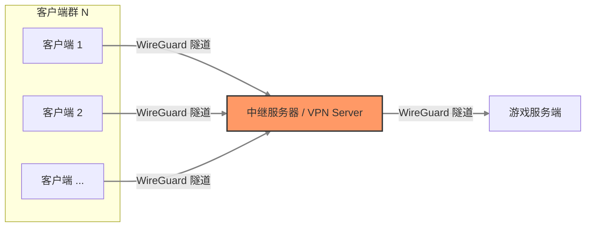

# 对 WireGuard VPN 环境下使用 TCP 协议的游戏服务器的网络优化指南

[TOC]

## 1. 概述

在通过 WireGuard (WG) 组网搭建游戏服务器（如 Minecraft Java版）时，常遇到“物理带宽充足，但游戏内严重卡顿、地图加载缓慢”的问题。

本文档基于实际排查案例，详细说明如何诊断 **“高丢包、低抖动”** 的线路特征，并通过调整 **MTU** 和开启 **TCP BBR** 拥塞控制算法，将 TCP 传输速度从 **4 Mbps 提升至 45 Mbps+**，彻底解决拥塞导致的网络性能瓶颈。

## 2. 环境

- **网络架构**：游戏客户端 - 中继节点 - 游戏服务端



- **组网工具**：WireGuard
- **测试工具**：iperf3
- **目标应用**：Minecraft Java版 (依赖 TCP)
- **操作系统**：
  - 中继节点：Linux
  - 服务端：Linux
  - 客户端：Windows
- **网络带宽**：
  - 客户端：上行 20 Mbps，下行 30 Mbps
  - 服务端：上行 100 Mbps，下行 100 Mbps
  - 中继节点：峰值上行 200 Mbps，峰值下行 200 Mbps

注：所有测试必须针对 **WireGuard 内网 IP** 进行，以确保流量经过加密隧道。

## 3. 网络质量检测与分析

在进行优化前，需要先了解网络当前的网络状况。这里使用 `iperf3` 进行测试。出于篇幅考虑，具体的安装过程略。

### 3.1. 准备

服务端的 WG 内网 IP： `10.8.0.100`
客户端的 WG 内网 IP： `10.8.0.10`

在服务端运行以下命令以启用 `iperf3` 服务端

```bash
iperf3 -s
```

启动后需要同时放行 5201 TCP 与 UDP 端口才可正常访问

### 3.2. TCP 性能测试

我们需要同时测试服务端 -> 客户端（服务器上行，客户端下行）与客户端 -> 服务端（服务端下行，客户端上行）的网络状况，其中

- 客户端 -> 服务端：代表玩家的操作指令（如移动、破坏方块）发送到服务器。

- 服务端 -> 客户端：代表服务器的数据（地图数据、实体）同步到玩家客户端。

#### 3.2.1. 服务端上行，客户端下行测试（服务端 -> 客户端）

在客户端执行以下命令以测试服务端→客户端的速率

```bash
iperf3 -c 10.8.0.100 -R -t 20
```

示例结果

```txt
Connecting to host 10.8.0.100, port 5201
Reverse mode, remote host 10.8.0.100 is sending
[  5] local 10.8.0.10 port 63292 connected to 10.8.0.100 port 5201
[ ID] Interval           Transfer     Bitrate
[  5]   0.00-1.00   sec  1.50 MBytes  12.6 Mbits/sec
[  5]   1.00-2.02   sec  1.00 MBytes  8.27 Mbits/sec
[  5]   2.02-3.01   sec   384 KBytes  3.17 Mbits/sec
[  5]   3.01-4.00   sec   384 KBytes  3.16 Mbits/sec
[  5]   4.00-5.01   sec   384 KBytes  3.13 Mbits/sec
[  5]   5.01-6.00   sec   512 KBytes  4.20 Mbits/sec
[  5]   6.00-7.01   sec   512 KBytes  4.17 Mbits/sec
[  5]   7.01-8.01   sec   384 KBytes  3.15 Mbits/sec
[  5]   8.01-9.00   sec   640 KBytes  5.27 Mbits/sec
[  5]   9.00-10.00  sec   512 KBytes  4.19 Mbits/sec
[  5]  10.00-11.01  sec   512 KBytes  4.16 Mbits/sec
[  5]  11.01-12.01  sec   256 KBytes  2.10 Mbits/sec
[  5]  12.01-13.01  sec   640 KBytes  5.24 Mbits/sec
[  5]  13.01-14.01  sec   512 KBytes  4.17 Mbits/sec
[  5]  14.01-15.01  sec   384 KBytes  3.16 Mbits/sec
[  5]  15.01-16.00  sec   384 KBytes  3.16 Mbits/sec
[  5]  16.00-17.01  sec   384 KBytes  3.12 Mbits/sec
[  5]  17.01-18.00  sec   512 KBytes  4.23 Mbits/sec
[  5]  18.00-19.00  sec   384 KBytes  3.14 Mbits/sec
[  5]  19.00-20.01  sec   512 KBytes  4.15 Mbits/sec
- - - - - - - - - - - - - - - - - - - - - - - - -
[ ID] Interval           Transfer     Bitrate         Retr
[  5]   0.00-20.08  sec  11.0 MBytes  4.59 Mbits/sec   69            sender
[  5]   0.00-20.01  sec  10.5 MBytes  4.40 Mbits/sec                  receiver
```

**数据分析**：

- 速度低：无论是平均带宽还是最高带宽都远低于物理带宽
- 波动大：速度曲线呈锯齿状，短短 20 秒内速度在 4 ± 2 Mbps 反复波动
- 重传异常：理想的重传次数为 0，这里有 69 次，看似不多，但在默认 TCP 算法下也足以导致吞吐量崩溃。

#### 3.2.2. 服务端下行，客户端上行测试（客户端 -> 服务端）

在客户端执行以下命令以测试服务端→客户端的速率

```bash
iperf3 -c 10.8.0.100 -t 20
```

示例结果

```txt
Connecting to host 10.8.0.100, port 5201
[  5] local 10.8.0.10 port 51859 connected to 10.8.0.100 port 5201
[ ID] Interval           Transfer     Bitrate
[  5]   0.00-1.01   sec  1.75 MBytes  14.6 Mbits/sec
[  5]   1.01-2.00   sec  1.62 MBytes  13.7 Mbits/sec
[  5]   2.00-3.01   sec  1.75 MBytes  14.5 Mbits/sec
[  5]   3.01-4.01   sec  1.75 MBytes  14.8 Mbits/sec
[  5]   4.01-5.00   sec  1.62 MBytes  13.7 Mbits/sec
[  5]   5.00-6.00   sec  1.75 MBytes  14.7 Mbits/sec
[  5]   6.00-7.01   sec  1.62 MBytes  13.5 Mbits/sec
[  5]   7.01-8.01   sec  2.12 MBytes  17.9 Mbits/sec
[  5]   8.01-9.01   sec  1.62 MBytes  13.7 Mbits/sec
[  5]   9.01-10.00  sec  1.75 MBytes  14.7 Mbits/sec
[  5]  10.00-11.01  sec  1.62 MBytes  13.5 Mbits/sec
[  5]  11.01-12.01  sec  1.62 MBytes  13.7 Mbits/sec
[  5]  12.01-13.00  sec  1.75 MBytes  14.7 Mbits/sec
[  5]  13.00-14.01  sec  1.75 MBytes  14.5 Mbits/sec
[  5]  14.01-15.01  sec  1.62 MBytes  13.7 Mbits/sec
[  5]  15.01-16.00  sec  1.75 MBytes  14.8 Mbits/sec
[  5]  16.00-17.01  sec  1.75 MBytes  14.6 Mbits/sec
[  5]  17.01-18.01  sec  1.62 MBytes  13.7 Mbits/sec
[  5]  18.01-19.00  sec  2.00 MBytes  16.9 Mbits/sec
[  5]  19.00-20.01  sec  2.00 MBytes  16.6 Mbits/sec
- - - - - - - - - - - - - - - - - - - - - - - - -
[ ID] Interval           Transfer     Bitrate
[  5]   0.00-20.01  sec  34.9 MBytes  14.6 Mbits/sec                  sender
[  5]   0.00-20.04  sec  34.8 MBytes  14.5 Mbits/sec                  receiver
```

**数据分析**：

- 链路不对称：上行速率 (14.6 Mbps) 远远好于 下行速率 (4.59 Mbps)。这证明了物理线路本身是有潜力的（至少能跑 15Mbps+），问题可能在于服务端向客户端发送数据时，TCP 协议处理丢包的方式效率低下。

- 稳定性尚可：相比于下行带宽的剧烈波动，上行带宽相对平稳（维持在 13-17 Mbps 之间）。

#### 3.2.3. 结论

上述测试表明服务端 -> 客户端出现了瓶颈，实际游戏过程中会出现如“我挖了方块（指令发出去了），但方块过一会才消失（服务器回传的数据卡住了）”等状况。

问题主要集中在下行链路（服务端 -> 客户端）的 TCP 拥塞控制上，因此有两个方向可待优化：

1. 丢包率
2. TCP 拥塞控制算法

### 3.3. UDP 链路体质检测

尽管我们的目标是优化 TCP 链接，但 UDP 测试可用于摸清物理线路的真实质量（带宽、抖动、丢包率）。只有硬性条件达标才有优化的潜力，否则无论如何都难以达到满意的效果。

保持服务端的 `iperf3` 服务端开启，在客户端执行以下命令：

```bash
iperf3 -c 10.8.0.100 -u -b 20M -R -t 10
```

示例结果

```txt
Connecting to host 10.8.0.100, port 5201
Reverse mode, remote host 10.8.0.100 is sending
[  5] local 10.8.0.10 port 55424 connected to 10.8.0.100 port 5201
[ ID] Interval           Transfer     Bitrate         Jitter    Lost/Total Datagrams
[  5]   0.00-1.00   sec  2.39 MBytes  20.0 Mbits/sec  0.044 ms  10/2145 (0.47%)
[  5]   1.00-2.01   sec  2.40 MBytes  19.9 Mbits/sec  0.032 ms  20/2166 (0.92%)
[  5]   2.01-3.01   sec  2.36 MBytes  19.9 Mbits/sec  0.052 ms  13/2123 (0.61%)
[  5]   3.01-4.00   sec  2.35 MBytes  19.9 Mbits/sec  0.053 ms  17/2119 (0.8%)
[  5]   4.00-5.01   sec  2.40 MBytes  19.9 Mbits/sec  0.031 ms  16/2163 (0.74%)
[  5]   5.01-6.01   sec  2.35 MBytes  19.8 Mbits/sec  0.056 ms  20/2119 (0.94%)
[  5]   6.01-7.00   sec  2.35 MBytes  19.9 Mbits/sec  0.039 ms  14/2113 (0.66%)
[  5]   7.00-8.01   sec  2.40 MBytes  19.9 Mbits/sec  0.037 ms  8/2152 (0.37%)
[  5]   8.01-9.01   sec  2.37 MBytes  19.9 Mbits/sec  0.060 ms  7/2121 (0.33%)
[  5]   9.01-10.01  sec  2.39 MBytes  19.9 Mbits/sec  0.054 ms  11/2143 (0.51%)
- - - - - - - - - - - - - - - - - - - - - - - - -
[ ID] Interval           Transfer     Bitrate         Jitter    Lost/Total Datagrams
[  5]   0.00-10.07  sec  24.0 MBytes  20.0 Mbits/sec  0.000 ms  0/21434 (0%)  sender
[SUM]  0.0-10.1 sec  7 datagrams received out-of-order
[  5]   0.00-10.01  sec  23.8 MBytes  19.9 Mbits/sec  0.054 ms  136/21364 (0.64%)  receiver
```

**结果分析指标：**

| 指标           | 理想值            | 故障案例值 | 分析               |
| :------------- | :---------------- | :--------- | :----------------- |
| Bitrate (带宽) | 跑满设定值（20M） | 19.9 Mbps  | 合格，物理带宽充足 |
| Jitter (抖动)  | < 30ms            | 0.054 ms   | 延迟稳定，适合游戏 |
| Lost (丢包率)  | 0%                | 0.64 %     | 存在隐患           |

### 3.4. 诊断结论

线路属于 **“高带宽、低抖动、轻微丢包”** 类型。

原因分析：尽管网络的物理条件达标，但 Linux 默认的 TCP 拥塞控制算法（Cubic）对丢包极其敏感，会将 0.6% 的丢包误判为网络严重拥堵，从而主动降低发送速度，导致“宽带跑不满”。

> Cubic 算法通过立方函数平滑调节拥塞窗口。在无丢包时窗口按时间三次函数增长，遇丢包后快速下降并进入平稳期，利用函数拐点实现高带宽利用与RTT公平。简单来说，即遭遇丢包后会快速降低带宽。

## 4. 优化策略

针对上述诊断结果，可采取两个措施来优化丢包率，并减少因为丢包造成的网络带宽波动。

### 4.1. 降低 WireGuard 的 MTU

防止因为 VPN 头部封装导致数据包超过链路限制，造成分片或丢包。

**操作对象**：**客户端**、**服务器端**与**中继节点**

**配置建议**：将 MTU 设置为 WireGuard 的安全下限值： **1280**。

打开 WireGuard 的配置文件（如`wg0.conf`），作如下所示的修改，以设置其 MTU

```ini
[Interface]
# ... 其他配置 ...
MTU = 1280
```

修改后需重启 WireGuard。

**代价**：

尽管降低 MTU 能有效避免分片导致的丢包黑洞，但较低的 MTU 也会带来以下副作用：

- 协议开销增加：每个数据包都包含固定的头部信息（IP头 + UDP头 + WireGuard加密头 = 约 60-80 字节）。MTU 越小，有效载荷的占比就越低。这意味着传输同样大小的文件，需要发送更多的数据包，带宽利用率会有轻微下降（约下降 2% - 5%）。

- CPU 负载上升：由于单个包携带的数据变少，为了维持同样的总传输速率，系统每秒需要处理的数据包数量会增加。这会增加 CPU 在中断处理、路由查找以及 WireGuard 加密/解密运算上的压力。尽管这些增加的计算压力影响通常极其轻微，但对于性能极弱的路由器或单核 VPS，可能会成为高负载下的瓶颈。

- 大文件传输效率略降：对于游戏数据（以小包为主）的影响微乎其微，但进行大文件传输时速度上限时相对较高 MTU（1500）会略低。

但对于游戏服务器场景，稳定性 >> 极限带宽，牺牲微小的带宽效率和 CPU 性能来换取连接稳定性是完全值得的。

### 4.2. 启用 BBR 拥塞控制算法

Linux 默认的 Cubic 拥塞控制算法在遭遇丢包时会大幅降低带宽，造成带宽波动，在存在丢包的环境下通常会显著影响带宽表现。

Google 的 BBR 算法不以丢包作为拥塞判断标准，而是基于“带宽和延迟”的模型。BBR 通过测量网络瓶颈带宽和最小往返时延来智能调节发包速率，以对抗网络拥塞并获得更高吞吐与更低延迟。这使得它能忽略线路上的物理随机丢包，强行利用剩余带宽。

因此，通过将 Linux 默认的 TCP 拥塞控制算法从 Cubic 替换为 BBR 通常可以有效改善带宽表现。

**操作对象**： **服务器端**以及**中继节点**。

**操作步骤**：

打开 `/etc/sysctl.conf` 文件，在文件末尾添加以下配置项

```conf
# ... 其他配置项 ...

net.core.default_qdisc=fq
net.ipv4.tcp_congestion_control=bbr
```

然后执行以下命令以重新加载 `/etc/sysctl.conf`

```bash
sudo sysctl -p
```

验证状态

```bash
sysctl net.ipv4.tcp_congestion_control
# 输出应为: net.ipv4.tcp_congestion_control = bbr
```

## 5. 优化后效果验证

再次执行以下命令运行 TCP 测试

```bash
iperf3 -c 10.8.0.100 -R -t 20
```

示例结果

```txt
Connecting to host 10.8.0.100, port 5201
Reverse mode, remote host 10.8.0.100 is sending
[  5] local 10.8.0.10 port 63878 connected to 10.8.0.100 port 5201
[ ID] Interval           Transfer     Bitrate
[  5]   0.00-1.01   sec  5.12 MBytes  42.5 Mbits/sec
[  5]   1.01-2.01   sec  5.38 MBytes  45.1 Mbits/sec
[  5]   2.01-3.01   sec  5.50 MBytes  46.1 Mbits/sec
[  5]   3.01-4.01   sec  5.62 MBytes  47.2 Mbits/sec
[  5]   4.01-5.01   sec  5.38 MBytes  45.2 Mbits/sec
[  5]   5.01-6.00   sec  5.62 MBytes  47.5 Mbits/sec
[  5]   6.00-7.01   sec  5.38 MBytes  44.6 Mbits/sec
[  5]   7.01-8.01   sec  5.50 MBytes  46.5 Mbits/sec
[  5]   8.01-9.00   sec  5.50 MBytes  46.2 Mbits/sec
[  5]   9.00-10.00  sec  5.38 MBytes  45.2 Mbits/sec
[  5]  10.00-11.01  sec  5.25 MBytes  43.5 Mbits/sec
[  5]  11.01-12.01  sec  6.00 MBytes  50.5 Mbits/sec
[  5]  12.01-13.00  sec  5.50 MBytes  46.4 Mbits/sec
[  5]  13.00-14.00  sec  5.38 MBytes  45.1 Mbits/sec
[  5]  14.00-15.00  sec  4.12 MBytes  34.7 Mbits/sec
[  5]  15.00-16.01  sec  5.62 MBytes  46.6 Mbits/sec
[  5]  16.01-17.01  sec  5.50 MBytes  46.1 Mbits/sec
[  5]  17.01-18.00  sec  5.50 MBytes  46.8 Mbits/sec
[  5]  18.00-19.01  sec  5.50 MBytes  45.5 Mbits/sec
[  5]  19.01-20.01  sec  5.12 MBytes  43.1 Mbits/sec
- - - - - - - - - - - - - - - - - - - - - - - - -
[ ID] Interval           Transfer     Bitrate         Retr
[  5]   0.00-20.00  sec   112 MBytes  46.8 Mbits/sec  9277            sender
[  5]   0.00-20.01  sec   108 MBytes  45.2 Mbits/sec                  receiver
```

**预期结果对比：**

| 指标        | 优化前   | 优化后   | 说明                                                                                             |
| ----------- | -------- | -------- | ------------------------------------------------------------------------------------------------ |
| 平均带宽    | 4.5 Mbps | 45 Mbps  | 速度提升 10 倍，跑满物理带宽                                                                     |
| 稳定性      | 极不稳定 | 非常平稳 | 解决卡顿问题的关键                                                                               |
| Retr (重传) | 50       | ~9000+   | 注意：BBR 模式下高重传是正常的。它代表算法在激进地抵抗物理丢包，只要速度达标，无需理会高重传数。 |

## 6. 总结

1. **对于 TCP 业务 (如 Minecraft Java)**：在有轻微丢包的线路上，**开启 BBR 是必须的**。它能将“不可玩”的网络变成“流畅”的网络。
2. **对于 UDP 业务 (Minecraft Bedrock)**：BBR 无法优化 UDP 协议。如果物理线路丢包率持续高于 1%，可能会出现轻微回档，但 BBR 带来的带宽红利能保证整体连接不中断。
3. **MTU 1280** 是 WireGuard 组网中最稳妥的设置，能有效避免大量隐性的连接超时问题。
