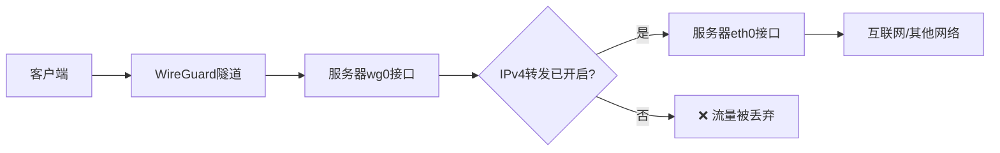

## 服务器端配置

### Linux

(1) 安装 WireGuard

```bash
sudo apt install wireguard
```

(2) 创建密钥对

```bash
wg genkey | tee server_private.key
wg pubkey < server_private.key | tee server_public.key
```

(3) 创建配置文件

`wg0.conf`

```ini
[Interface]
# 服务器在虚拟网络中的 IP 地址
Address = 10.8.0.1/24
# WireGuard 监听的UDP端口，需在防火墙放行
ListenPort = 51820
# 服务器私钥，填入wg genkey生成的密钥
PrivateKey = [SERVER/key]

# 启动 WireGuard 时执行的命令
PostUp = iptables -A FORWARD -i %i -j ACCEPT;
PostUp = iptables -A FORWARD -o %i -j ACCEPT;
PostUp = iptables -t nat -A POSTROUTING -o eth0 -j MASQUERADE

# 停止 WIreGuard 时执行的命令
PostDown = iptables -D FORWARD -i %i -j ACCEPT;
PostDown = iptables -D FORWARD -o %i -j ACCEPT;
PostDown = iptables -t nat -D POSTROUTING -o eth0 -j MASQUERADE

# 定义允许接入虚拟网络的客户端，每个Peer表示一个客户端
[Peer]
# 客户端公钥
PublicKey = [CLIENT/pubkey]
# 允许该客户端使用的 IP 地址，通常用/32以完全限定 IP
AllowedIPs = 10.8.0.2/32
```

注：iptables 的一系列操作用于在运行时启用/停用流量转发和 NAT 伪装。其中 `-o eth0` 可能需要根据实际默认路由接口进行调整，可使用 `ip route show default | awk '{print $5}'` 命令快速获取默认路由接口。

(4) 启用 IPv4 转发

```bash
sudo sysctl -w net.ipv4.ip_forward=1
```

查看当前 `net.ipv4.ip_forward` 的值

```bash
cat /proc/sys/net/ipv4/ip_forward
```



(5) 启动/关闭隧道

启动

```bash
sudo wg-quick up wg0
```

查看状态

```bash
sudo wg
```

关闭

```bash
sudo wg-quick down wg0
```

## 客户端配置

### Windows

(1) 下载 WireGuard 并安装

https://zh-wireguard.com/install/

(2) 创建配置

打开 WireGuard，点击`新建隧道`->`新建空隧道`，在配置输入框中填入并保存以下信息

```ini
[Interface]
# 客户端私钥，由WireGuard自动生成
PrivateKey = [AUTO_GENERATED]
# 虚拟局域网地址
Address = 10.8.0.2/24

[Peer]
# 服务器端公钥
PublicKey = [SERVER/pubkey]
# 路由规则，允许的IP范围，这一值决定哪些流量会通过WireGuard服务器
AllowedIPs = 10.8.0.0/24
# 服务器端公网地址:端口，需要放行指定端口的 UDP 协议
Endpoint = [SERVER/ip:port]
# 保活消息发送间隔，单位为秒
PersistentKeepalive = 25
```

(3) 连接/断开

选中隧道配置文件后点击 `连接`/`断开` 即可

### Linux

(1) 安装 WireGuard

```bash
sudo apt install wireguard
```

(2) 创建密钥对

```bash
wg genkey | tee client_private.key
wg pubkey < client_private.key | tee client_public.key
```

(3) 创建配置文件

`client.conf`

```ini
[Interface]
# 客户端私钥，填入client_private.key的内容
PrivateKey = [CLIENT/key]
# 虚拟局域网地址
Address = 10.8.0.2/24

[Peer]
# 服务器端公钥
PublicKey = [SERVER/pubkey]
# 路由规则，允许的IP范围，这一值决定哪些流量会通过WireGuard服务器
AllowedIPs = 10.8.0.0/24
# 服务器端公网地址:端口，需要放行指定端口的 UDP 协议
Endpoint = [SERVER/ip:port]
# 保活消息发送间隔，单位为秒
PersistentKeepalive = 25
```

(4) 连接/断开

连接

```bash
sudo wg-quick up client
```

查看状态

```bash
sudo wg
```

断开

```
sudo wg-quick download client
```
