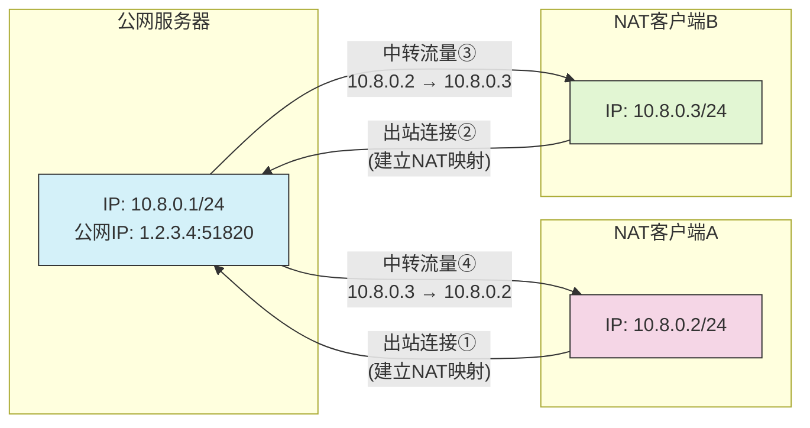
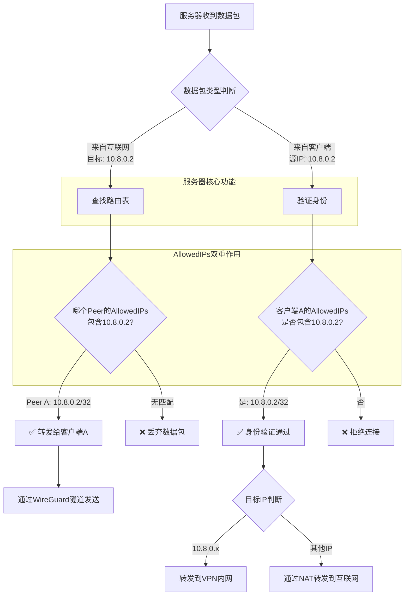
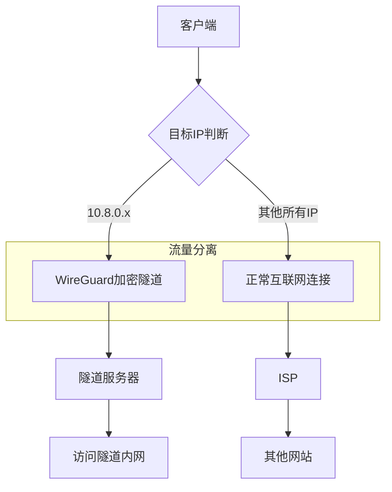

## 网络拓扑

通过 WireGuard 实现客户端 A 和客户端 B 的通讯

| 终端     | 内网 IP     | Endpoint      |
| -------- | ----------- | ------------- |
| 服务器端 | 10.8.0.1/24 | 1.2.3.4:51820 |
| 客户端 A | 10.8.0.2/24 |
| 客户端 B | 10.8.0.3/24 |



## 配置项

### AllowedIPs

| 配置位置     | `AllowedIPs` 值 | 含义                       | 作用                                                                           |
| ------------ | --------------- | -------------------------- | ------------------------------------------------------------------------------ |
| **服务器端** | `10.8.0.2/32`   | 允许客户端使用的源 IP      | 1. 身份验证（哪个 IP 对应哪个公钥）<br>2. 路由决策（发往 10.8.0.2 的流量给谁） |
| **客户端端** | `10.8.0.0/24`   | 客户端要加密的目标 IP 范围 | 1. 决定哪些流量走 VPN<br>2. 路由分流                                           |

**例：**

服务器端

```ini
[Interface]
Address = 10.8.0.1/24
ListenPort = 51820
PrivateKey = [SERVER/key]

[Peer]
PublicKey = [CLIENT/pubkey]
AllowedIPs = 10.8.0.2/32  # 仅允许客户端用10.8.0.2
```



客户端

```ini
[Interface]
Address = 10.8.0.2/24
PrivateKey = [CLIENT/key]

[Peer]
PublicKey = [SERVER/pubkey]
Endpoint = [SERVER/ip:port]
AllowedIPs = 10.8.0.0/24  # 访问 VPN 内网都走隧道
```


